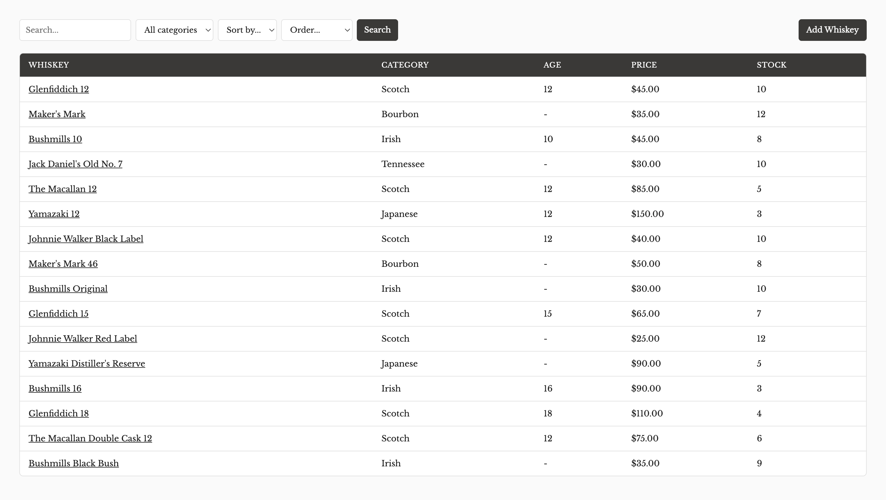
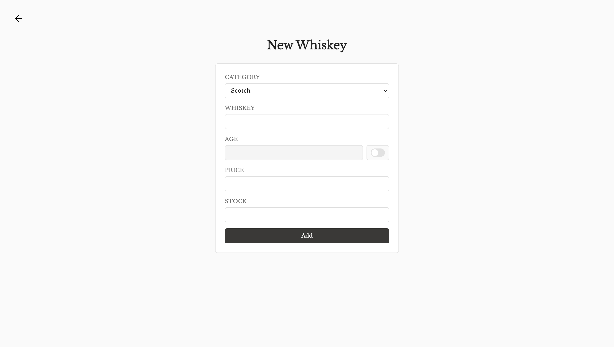
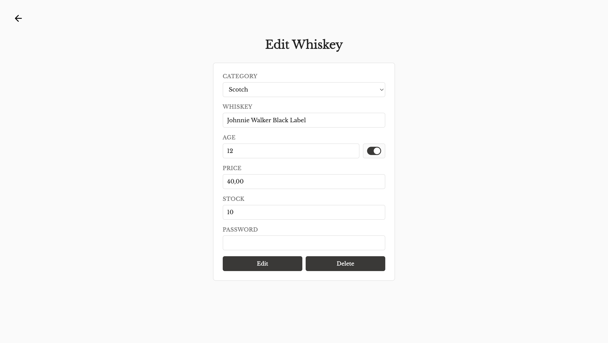

# Whiskey Inventory

An inventory management app for whiskey bottles, built with Node.js, Express, and PostgreSQL.

🔗 [Live Demo](https://whiskey-inventory-a5h4.onrender.com)

## Screenshots

### Inventory

### New Whiskey

### Edit Whiskey

## Features

- Search whiskeys by name
- Filter by category
- Sort by name, age, price, or stock
- Add new whiskeys through a validated form
- Edit or delete existing whiskeys (password protected)
- Custom 404 error page

## Built with

- Node.js
- Express
- EJS
- CSS
- PostgreSQL
- Render
- Neon
